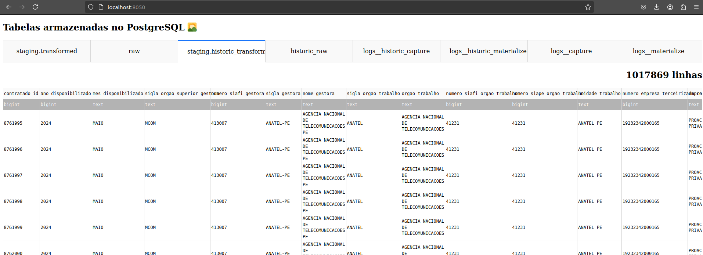
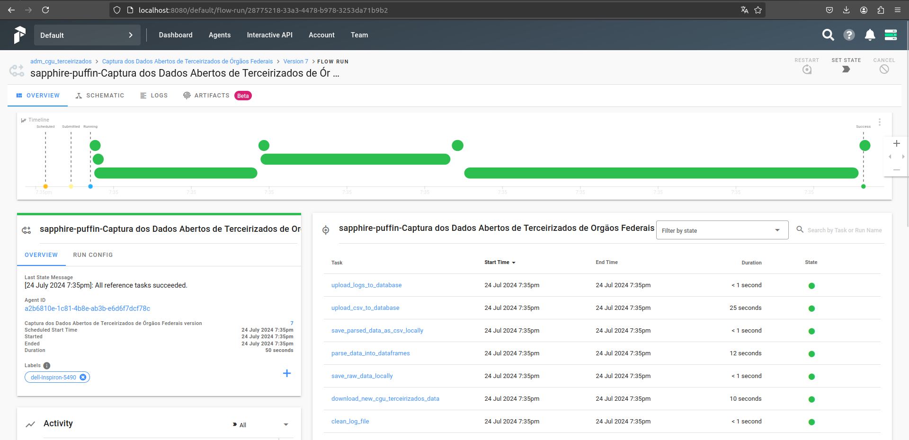
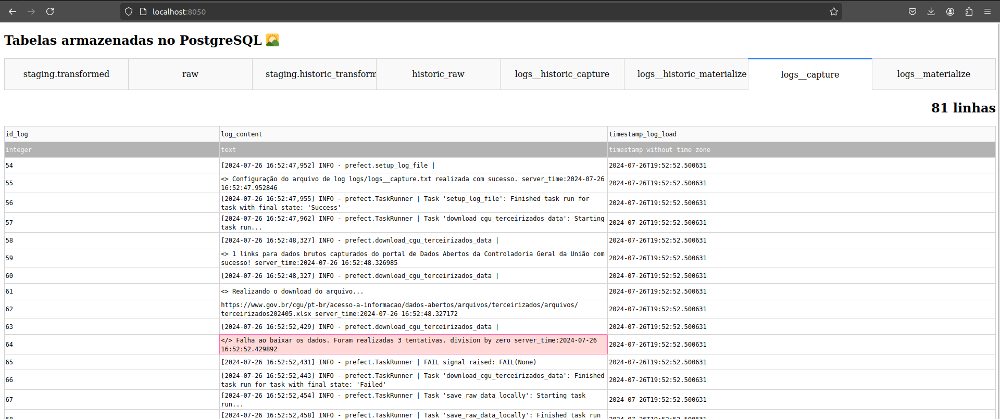

# Desafio Engenheiro de Dados @ Escritório de Dados
## Capture e Materialize os Dados Abertos de Terceirizados de Órgãos Federais

### Flow de Captura de Dados:
- **SETUP**: 🧹 Limpar Arquivo de Log -> 🔧 Configurar Arquivo de Log ->

- **EXTRACT**: -> ⬇️ Baixar Dados do [portal de Dados Abertos da CGU](https://www.gov.br/cgu/pt-br/acesso-a-informacao/dados-abertos/arquivos/terceirizados) -> 🧠 Salvar Dados Brutos em Memória ->

- **CLEAN**: -> 🔍 Interpretar Dados em DataFrames -> 📝 Salvar Dados como CSVs Localmente ->

- **LOAD**: -> ⬆️ Carregar CSVs para o Banco de Dados brutos -> ⬆️ Carregar Logs para o Banco de Dados

### Flow de Materialização dos Dados:
- **SETUP**: 🧹 Limpar Arquivo de Log  -> 🔧 Configurar Arquivo de Log ->

- **TRANSFORM (DBT)**:

&nbsp;&nbsp;&nbsp;&nbsp;&nbsp;&nbsp; -> 📦 staging.raw (Dados Brutos) ->

&nbsp;&nbsp;&nbsp;&nbsp;&nbsp;&nbsp; -> 🧼 staging.cleaned (Dados com valor nulo padrão) ->

&nbsp;&nbsp;&nbsp;&nbsp;&nbsp;&nbsp; -> 📝 staging.renamed (Dados renomeados seguindo manuais de estilo do [ED](https://docs.dados.rio/guia-desenvolvedores/manual-estilo/#nome-e-ordem-das-colunas) e [BD](https://basedosdados.github.io/mais/style_data/)) ->

&nbsp;&nbsp;&nbsp;&nbsp;&nbsp;&nbsp; -> 🔶 staging.transformed (Dados com tipos definidos) ->

- **LOAD**: -> ⬆️ Carregar Logs para o Banco de Dados

###

### Funcionalidades:
- **Captura dos dados mais recentes** (`python run/capture.py`)
- **Materialização dos dados mais recentes** (`python run/materialize.py`)
- **Captura dos dados históricos** - Todos os dados já disponibilizados (`python run/historic_capture.py`)
- **Materialização dos dados históricos** - 🚧 Não trata erro de offset de colunas em dados históricos (`python run/historic_materialize.py`)
- **Scheduler** - Definição de cronograma de execução de flows Prefect de captura e materialização (`python run/scheduler.py`)
- **Results** - App Dash para visualizar tabelas resultantes armazenadas no banco de dados PostgreSQL (`python run/results.py`)

---
### Para Capturar e Materializar os Dados Abertos de Terceirizados de Órgãos Federais:

Configure o ambiente virtual python (venv):

0. :
   ```sh
   python -m venv orchestrator && source orchestrator/bin/activate && cp .env.example .env && pip install --no-cache-dir -r requirements/start.txt
   ```

**Param-se todos os containers docker**, além de processos do host que estejam utilizando as portas necessárias pelo servidor Prefect e as funcionalidades disponibilizadas:

0. :
   ```sh
   sudo chmod +x stop.sh && ./stop.sh
   ```

#### **Execute o Servidor Prefect dentro de um container Docker local:**

Construa a imagem docker local:
1. : 
   ```sh
   docker build -t terceirizados_pipeline .
   ```
   ou
   ```sh
   sudo docker buildx create --name builder
   sudo docker buildx build . --tag terceirizados_pipeline
   ```
&nbsp;&nbsp;&nbsp;&nbsp;pode demorar alguns minutos... ☕ 

Execute o Servidor Prefect em um container docker local:

2. : 
   ```sh
   docker run -it --privileged -v /var/run/docker.sock:/var/run/docker.sock -p 8080:8080 -p 8050:8050 -p 4200:4200 terceirizados_pipeline
   ```

3. :
   ```sh
   apollo_1    | Server ready at http://0.0.0.0:4200 🚀
   ```
O Servidor Prefect está online!
---
### Em outro terminal, execute as funcionalidades do serviço:

4. :
   ```
   source orchestrator/bin/activate && prefect server create-tenant --name tenant && prefect create project adm_cgu_terceirizados
   ```

5. :
   ```
   python ./run/capture.py && python ./run/materialize.py && python ./run/historic_capture.py && python ./run/historic_materialize.py
   ```
6. :
   Observe os logs no terminal do Servidor Prefect.

### Em um terceiro terminal, visualize os resultados:

7. :
   ```sh
   source orchestrator/bin/activate && pip install -r requirements/results.txt
   ```
8. :
   ```sh
   python ./run/results.py
   ```

#### **App Dash [localhost:8050](localhost:8050) para visualizar tabelas do PostgreSQL**
[localhost:8050](localhost:8050)


---
### Programe Cronograma para Captura de Dados:

8. :
   ```sh
   source orchestrator/bin/activate && python ./run/scheduler.py
   ```

A Captura e Materialização dos dados mais recentes é programada para ocorrer **a cada 4 meses, começando em Maio**. Se ocorrer uma falha no Flow, uma nova tentativa ocorre diaramente até ser bem sucedida.

#### Dashboard Prefect [localhost:8080](localhost:8080) para acompanhar os Flows:
[localhost:8080](localhost:8080)

#### Alternativamente, tudo através de Bash Script:

0. :
   ```sh
   sudo chmod +x start.sh stop.sh && stop.sh
   ```
1. :
   ```sh
   ./start.sh
   ```

#### Para parar o Servidor e Agente(s) Prefect

0. :
   ```sh
   sudo chmod +x stop.sh
   ```

1. :
   ```sh
   ./stop.sh
   ```

### Conectar diretamente ao PostgreSQL:

9. : 
   ```
   docker exec -it $(docker ps | grep 'postgres:11' | awk '{print $1}') bash
   ```
10. :
   ```sh
   psql -U prefect -d prefect_server -W
   ```
11. :
Escreva a senha: "test-password"

### #help
###
caso:
   ```sh
   Error: [Errno 2] No such file or directory: 'path/orchestrator/bin/python'
   ```

1. :
   ```sh
   rm -rf "orchestrator"
   ```

caso:
```sh
   (orchestrator) user@machine:~/path$ start.sh
   Pulling postgres ... done
   Pulling hasura   ... done
   Pulling graphql  ... done
   Pulling apollo   ... done
   Pulling towel    ... done
   Pulling ui       ... done
   Starting tmp_postgres_1 ... error

   ERROR: for tmp_postgres_1  Cannot start service postgres: network $ID not found

   ERROR: for postgres  Cannot start service postgres: network $ID not found
   ERROR: Encountered errors while bringing up the project.
   ```
1. :
   ```sh
   docker network prune -f
   ```

   se erro permanecer, limpe todos os processos relacionados com a pipeline:
1. 
   ```sh
   ./stop.sh
   ```

###

caso:
&nbsp; Sistema Operacional host seja Windows:

1. : Utilize o WSL

caso:
&nbsp; Falha (</>) em alguma _@task_ dos Flows:

1. :
   ```sh
   source orchestrator/bin/activate && pip install -r requirements/results.txt
   ```
2. :
   ```sh
   python ./run/results.py
   ```
Visualize resultados parciais e logs de falha em [localhost:8050](localhost:8050):


---
#### Dicionário de Dados Materializados no PostgreSQL:
####

| Column Name                      | Data Type        | Descrição                                                                 |
|----------------------------------|------------------|--------------------------------------------------------------------------|
| contratado_id                    | BIGINT           | Identificador do registro do terceirizado na base de dados.               |
| ano_disponibilizado              | BIGINT           | Ano da carga de dados/ Ano da disponibilização dos dados brutos no portal de Dados Abertos da Controladoria Geral da União. |
| mes_disponibilizado              | TEXT             | Mês da carga de dados/ Mês da disponibilização dos dados brutos no portal de Dados Abertos da Controladoria Geral da União. |
| sigla_orgao_superior_gestora     | TEXT             | Sigla do órgão superior da unidade gestora do terceirizado.               |
| numero_siafi_gestora             | BIGINT           | Código da unidade gestora (proveniente do Sistema Integrado de Administração Financeira do Governo Federal - SIAFI) do terceirizado. |
| sigla_gestora                    | TEXT             | Sigla da unidade gestora do terceirizado.                                 |
| nome_gestora                     | TEXT             | Nome da unidade gestora do terceirizado.                                  |
| sigla_orgao_trabalho             | TEXT             | Sigla da unidade gestora do terceirizado.                                 |
| orgao_trabalho                   | TEXT             | Nome do órgão onde o terceirizado trabalha.                               |
| numero_siafi_orgao_trabalho      | BIGINT           | Código SIAFI do órgão onde o terceirizado trabalha.                       |
| numero_siape_orgao_trabalho      | BIGINT           | Código SIAPE (Sistema de Administração de Pessoal) do órgão onde o terceirizado trabalha. |
| unidade_trabalho                 | TEXT             | Descrição da unidade onde o terceirizado trabalha.                        |
| numero_empresa_terceirizada_cnpj | BIGINT           | CNPJ da empresa terceirizada.                                             |
| empresa_terceirizada_razao_social| TEXT             | Razão Social da empresa terceirizada.                                     |
| numero_contrato                  | TEXT             | Número do contrato com a empresa terceirizada.                            |
| categoria_profissional_cbo       | TEXT             | Código da Classificação Brasileira de Ocupações (CBO) e descrição da categoria profissional do terceirizado. |
| jornada_trabalho_horas_semanais  | BIGINT           | Quantidade de horas semanais de trabalho do terceirizado.                 |
| escolaridade_exigida             | TEXT             | Nível de escolaridade exigido pela ocupação do terceirizado.              |
| valor_reais_mensal_salario       | DOUBLE PRECISION | Valor mensal do salário do terceirizado (R$).                             |
| valor_reais_mensal_custo         | DOUBLE PRECISION | Custo total mensal do terceirizado (R$).                                  |
| contratado_cpf                   | TEXT             | CPF do terceirizado.                                                      |
| contratado_nome                  | TEXT             | Nome do terceirizado.                                                     |
| timestamp_captura                | TIMESTAMP        | Timestamp da captura dos dados.                                           |

---
Para histórico git antes de (26/jul): 
https://github.com/FilipePrates/Desafio-CIVITAS-Data-Engineer/commits/main/